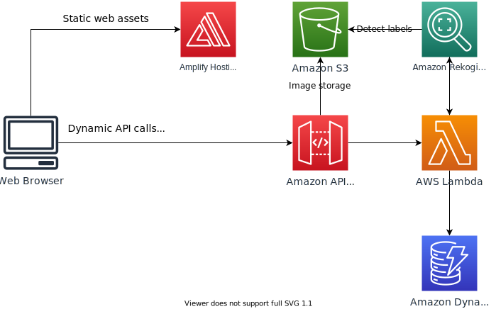

# Getting Started with Serverless Workshop

Workshop Link: <https://catalog.us-east-1.prod.workshops.aws/v2/workshops/841ce16b-9d86-48ac-a3f6-6a1b29f95d2b>

## Overview

In this tutorial, you'll create a simple [serverless](https://aws.amazon.com/serverless/) web application that implements a "Todo app" with an API to store and retrieve tasks in a cloud database. In addition, we will integrate machine learning to automatically identify and label objects in images attached to tasks.

- AWS Experience: Beginner (Basic HTML/CSS/JavaScript and Linux command line knowledge is helpful)
- Time to Complete: 2 hours
- Tutorial Prerequisites: An AWS account, a text editor, recommended browser: latest version of Chrome or Firefox, Amazon S3, AWS Lambda, Amazon API Gateway, AWS Amplify, Amazon DynamoDB, Amazon Rekognition, AWS Cloud9.

## Application Architecture

The application architecture uses AWS Lambda, Amazon API Gateway, Amazon DynamoDB, Amazon Simple Storage Service (S3), and AWS Amplify Console. Amplify Console provides continuous deployment and hosting of the static web resources including HTML, CSS, JavaScript, and image files which are loaded in the user's browser. JavaScript executed in the browser sends and receives data from a public backend API built using Lambda and API Gateway. DynamoDB provides a persistence layer where data can be stored by the API's Lambda function. S3 is used to store uploaded images. Finally, Amazon Rekognition is used to detect and label objects in those images.

## Modules

This workshop is divided into multiple steps. Each step describes a scenario of what we're going to build and step-by-step directions to help you implement the architecture and verify your work. The steps must be performed in order for the workshop to be successful.

1. Install prerequisites
1. Build a serverless backend
1. Configure a Lambda Authorizer
1. Build and deploy the web application
1. Test the application
1. Configure Amazon Rekognition Integration
1. Terminate Resources
